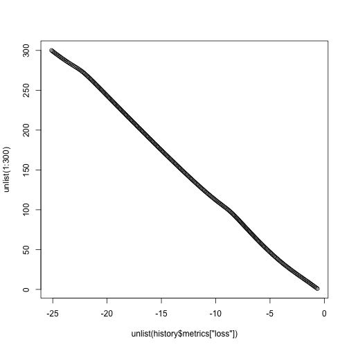

MachineLearning
========================================================
author: Prateek Sarangi
date: Tue, Apr 7 2020
autosize: true

Import dataset and view it as a dataframe
========================================================
## Feature enginerring and data analysis done for the dataset.

```r
heart <- read.csv("heart1.csv")
head(heart)
```

```
  age sex   cp trestbps chol fbs restecg   thalach exang oldpeak slope  ca thal
1 0.6 0.9 0.01      0.6  0.3 0.1     0.3 0.6030534   0.9     2.3  0.01 0.9  0.1
2 0.1 0.9 0.90      0.6  0.3 0.9     0.9 0.8854962   0.9     3.5  0.01 0.9  0.1
3 0.1 0.1 0.60      0.6  0.1 0.9     0.3 0.7709924   0.9     1.4  0.90 0.9  0.1
4 0.4 0.9 0.60      0.2  0.3 0.9     0.9 0.8167939   0.9     0.8  0.90 0.9  0.1
5 0.4 0.1 0.10      0.2  0.5 0.9     0.9 0.7022901   0.1     0.6  0.90 0.9  0.1
6 0.4 0.9 0.10      0.6  0.1 0.9     0.9 0.5877863   0.9     0.4  0.20 0.9  0.1
  target
1      1
2      1
3      1
4      1
5      1
6      1
```



```
$loss
[1] -26.55136

$accuracy
[1] 0.05940594
```


